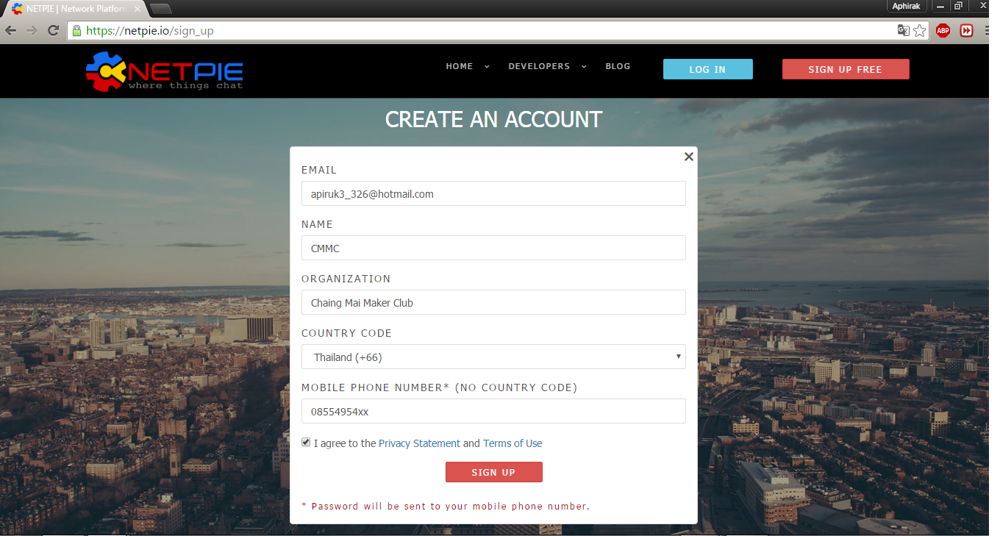
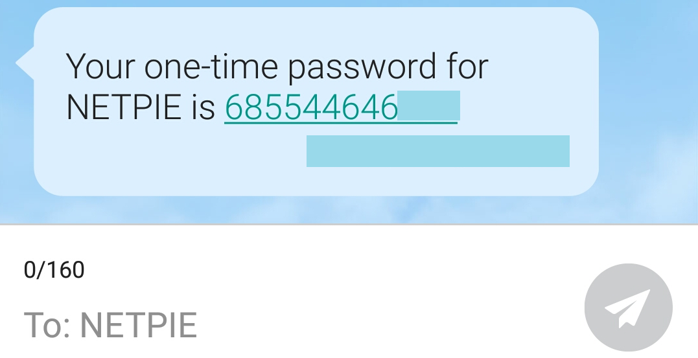
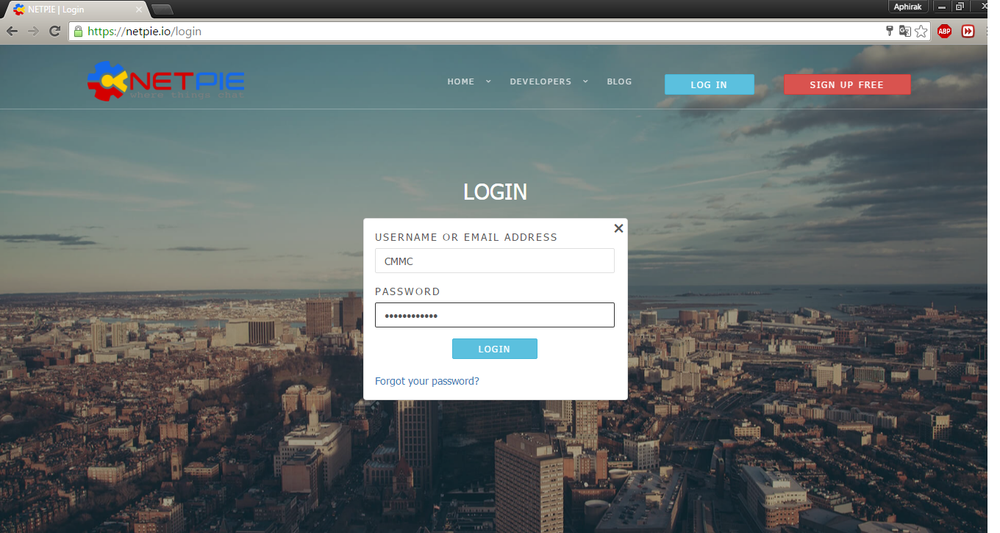
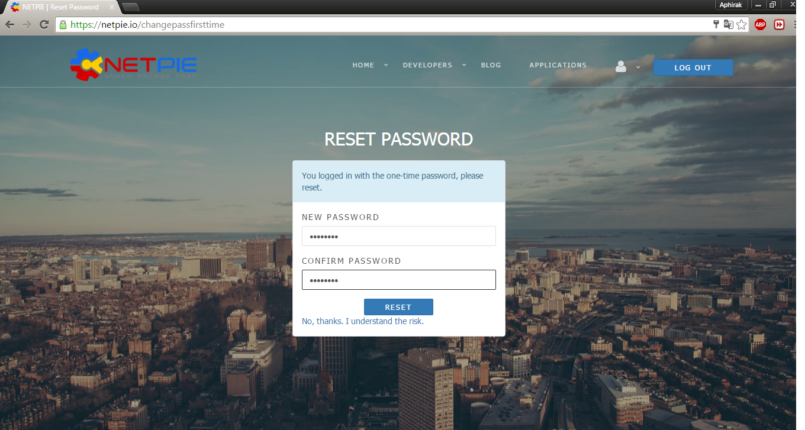
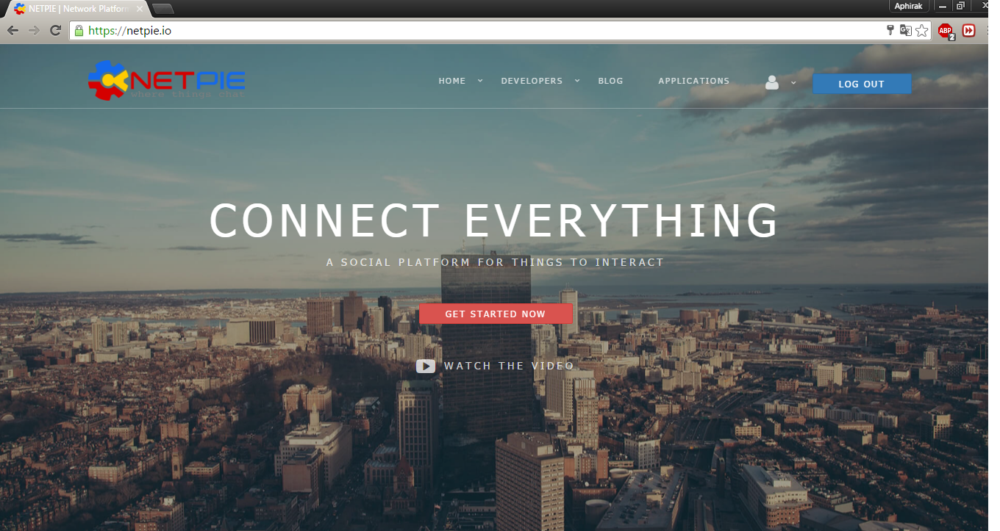

# ขั้นตอนการสมัครเข้าใช้งาน NETPIE.io

NETPIE.io คืออะไร
“NETPIE แพลตฟอร์ม IoT เพื่อนักพัฒนาและอุตสาหกรรมไทย” กระทรวงวิทยาศาสตร์และเทคโนโลยีโดย ศูนย์เทคโนโลยีอิเล็กทรอนิกส์และคอมพิวเตอร์แห่งชาติ (NECTEC) ได้เปิดตัวแพลตฟอร์มสำหรับนักพัฒนาซึ่งมีชื่อว่า NETPIE โดยย่อมาจาก Network Platform for Internet of Everything โดยเป็นคลาวด์เซิร์ฟเวอร์ที่ให้บริการในรูปแบบ Platform as a Service สำหรับติดต่อสื่อสาร แลกเปลี่ยนข้อมูลระหว่างอุปกรณ์ต่าง ๆ เหมาะสำหรับการพัฒนา IoT ในปัจจุบัน โดยรองรับการเชื่อมต่อผ่านอุปกรณ์ต่าง ๆ อาทิเช่น Arduino, Raspberry PI, ESP8266, HTML5 และ Node JS เป็นต้น NETPIE นั้นยังช่วยลดภาระด้านความปลอดภัยโดยผู้พัฒนาสามารถกำหนด หรือออกแบบได้เองทั้งหมด ดังนั้นแล้ว NETPIE จึงเป็นอีกทางเลือกหนึ่งสำหรับนักพัฒนา IoT ในยุคปัจจุบัน ซึ่งขั้นตอนการสมัครใช้งานมีดังต่อไปนี้

1)เข้าไปยังเว็บไซด์ netpie.io จากนั้นคลิ๊กที่ SIGN UP FREE

2)กรอกข้อมูลสำหรับใช้ในการสมัครให้เรียบร้อย แล้วคลิ๊ก SIGN UP

3)รอรับข้อความยืนยันในโทรศัพท์จาก NETPIE โดยจะส่งข้อความเข้ามายังเบอร์โทรศัพท์ที่ได้ลงทะเบียนไว้

4)เข้าหน้า LOG IN เพื่อทำการเข้าระบบ ให้ทำการกรอก ID ที่เราสมัคร และ Password ที่ได้จากข้อความในโทรศัพท์ลงไปแล้วกด LOG IN

5)จากนั้นจะได้หน้า RESET Password ซึ่งให้เราใส่รหัสใหม่ของเรา เพื่อง่ายต่อการเข้าใช้งานในครั้งต่อไป

6)เมื่อทำการ Reset Password เสร็จแล้ว จะเข้าสู่หน้าหลักก็สามารถใช้งาน NETPIE.io ได้อย่างสมบูรณ์
