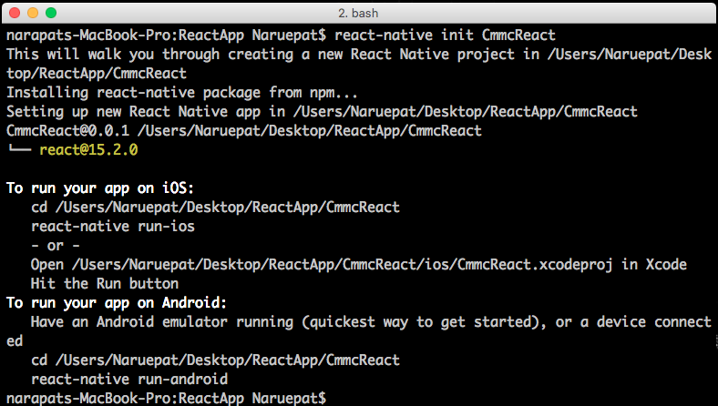

# การติดตั้ง React Native


React Native คืออะไร ? 
React Native มันคือ Framework ชนิดหนึ่งที่มีความสามารถในการสร้าง App Android และ iOS แล้วเจ้าตัว React-Native มันดีอย่างไรหล่ะ? เดี๋ยวเราไปดูกัน


 https://www.youtube.com/watch?v=juWhxCz1Wmg 


 ###ขั้นตอนการติดตั้ง React Native


 1. ติดตั้ง HomeBrew สำหรับเครื่อง Mac โดยใช้คำสั่งดังต่อไปนี้ใน command line
 
      ```/usr/bin/ruby -e "$(curl -fsSL https://raw.githubusercontent.com/Homebrew/install/master/install)"```
  
 2. ใช้ HomeBrew ในการ Install Node.js 
 
  ```brew install node```
  
 3. ใช้ npm ในการ Install React Native

    ```npm install -g react-native-cli```
  
 
###  มาลองสร้าง App จาก React-Native กันดู

  หลังจากติดตั้งเสร็จเรียบร้อยเรามาลองสร้างโปรเจค React-Native ง่าย ๆ กันครับ

เริ่มสร้างสร้าง Floder ที่เราจะใช้ในการเก็บแอปของเรากันก่อนนะครับ


หลังจากนั้นเปิดโปรแกรม Terminal พิมพ์ cd เพื่อจะเข้า Directory และทำการดึงโฟลเดอร์ที่สร้าง ReactApp เข้าไปใน Terminal แล้วกด Enter 1 ทีครับ

 
 
 
 
หลังจากที่เราเข้ามาใน Directory แล้วก็ทำการสร้างโปรเจคของเราขึ้นมาครับโดยใช้คำสั่ง

```react-native init CmmcReact```


จากนั้นก็รอจนกว่าจะสร้างโปรเจคของเราเสร็จครับ


หลังจากที่เสร็จเรียบร้อยแล้วหน้าตาจะออกมาเป็นแบบนี้ครับ 
เราลองมาทำการทดสอบดูครับว่าเมื่อรันออกมาแล้วหน้าตาของมันจะเป็นแบบนั้นกัน โดยผมจะทดสอบการรันในส่วนของ ios นะครับใช้คำสั่งต่อไปนี้คือ

```react-native run-ios```


เราก็จะได้หน้าตามาประมาณนี้นะครับ
จากที่เราได้ลองสร้าง React Native ขึ้นมาแล้วนะครับเราลองมาทดลองเขียนแอฟ เปิดปิดไฟ ง่าย ๆ กันดีกว่า ครับ


##มาเขียนแอฟเปิดปิดไฟ กันเถอะ!!

หลังจากที่เราได้ติดตั้งและทำการรันโค๊ดตัวอย่างกันไปแล้วนะครับ คราวนี้เราจะมา


